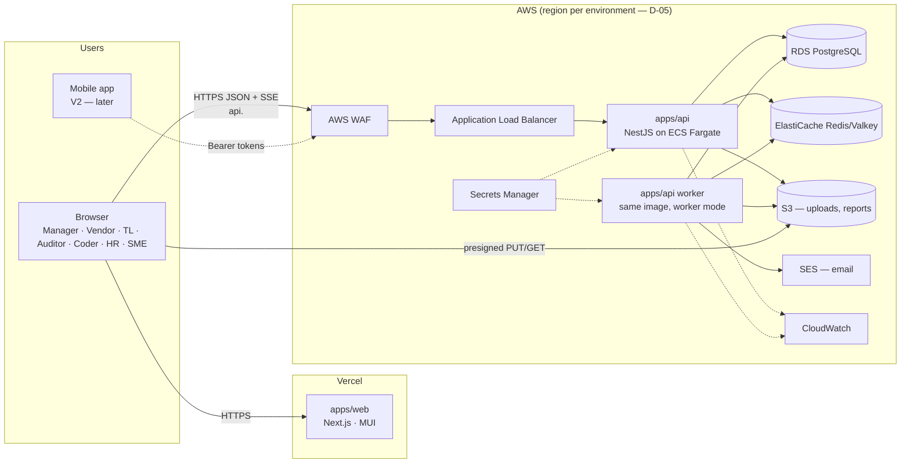

# 01 — System Architecture

Status: **Approved (Phase 0)** — final decisions applied

SmartCode V2 is built from zero. The previous SmartCode repository is used **only** as a reference for business requirements; no code, schema, migrations, data or Git history is carried over.

## 1. Architecture at a glance



| Layer | Choice | Why |
|---|---|---|
| Frontend | **Next.js (App Router) + TypeScript + Material UI** on **Vercel** | Requested stack; Vercel gives preview deployments per PR. |
| Backend | **NestJS + TypeScript** on **AWS ECS Fargate** | Long-running process: stable DB connection pool, SSE streams, background workers, no cold starts or function time limits. |
| Database | **PostgreSQL on AWS RDS** (Multi-AZ in production) | Highly relational domain; partial unique indexes and transactions enforce business invariants. |
| ORM | **Prisma** (migrations via `prisma migrate`) | Requested; typed queries; versioned migrations. Raw SQL only inside migrations for constraints Prisma can't express (partial indexes, triggers). |
| Jobs / cache | **Redis (ElastiCache Valkey)** + **BullMQ** | Email outbox, CSV processing, report generation, rate limiting store, SSE fan-out across API tasks. |
| Files | **S3** (private, KMS-encrypted, presigned URLs) | CSV uploads, generated reports, documents. Nothing large in PostgreSQL. |
| Email | **SES** + React Email templates | Activation, reset, notifications. |
| Secrets | **Secrets Manager** → ECS task secrets | No secrets in code, images or Git. |
| Monitoring | **CloudWatch** logs, metrics, alarms | Requested; structured JSON logs with request IDs. |
| IaC | **AWS CDK (TypeScript)** in `infra/cdk` | Same language as the app; reviewable, repeatable environments. |
| CI/CD | **GitHub Actions** (OIDC to AWS — no long-lived keys) + Vercel Git integration | Requested. |

### Why the API is not on Vercel

The earlier handoff explored running NestJS as Vercel functions. For V2 the target is AWS because SmartCode needs: (1) a bounded, long-lived PostgreSQL connection pool; (2) Server-Sent Events for realtime operational screens; (3) background workers for CSV imports, emails and PDF reports; (4) private networking between API and database. All four are natural on Fargate and awkward on serverless functions.

## 2. Repository / folder structure

```
smartcodev2/
├── apps/
│   ├── web/                    # Next.js frontend (Vercel)
│   │   ├── public/brand/       # logo + favicons copied from packages/brand at build
│   │   └── src/
│   │       ├── app/
│   │       │   ├── (public)/           # landing page
│   │       │   ├── (auth)/             # login, activate, forgot/reset password
│   │       │   └── (workspace)/        # authenticated shell (sidebar + header)
│   │       │       ├── manager/ vendor/ team-lead/ auditor/ coder/
│   │       │       ├── sme/ hr/ internal-audit/ settings/ admin/
│   │       ├── components/             # shared UI (DataTable, CsvImportWizard, StatusChip, …)
│   │       ├── features/<module>/      # module UI: pages' building blocks, hooks, forms
│   │       ├── lib/api/                # generated OpenAPI client + fetch wrapper
│   │       ├── lib/realtime/           # SSE client → query invalidation
│   │       └── theme/                  # MUI theme from packages/brand tokens
│   ├── api/                    # NestJS API + worker (AWS ECS)
│   │   ├── prisma/
│   │   │   ├── schema.prisma
│   │   │   ├── migrations/
│   │   │   └── seed/                   # system seed only (org, settings) — no business data
│   │   ├── src/
│   │   │   ├── main.ts                 # HTTP entrypoint
│   │   │   ├── worker.ts               # BullMQ worker entrypoint (same image)
│   │   │   ├── core/                   # config, prisma, auth guards, RBAC, scope, logging, errors
│   │   │   ├── common/                 # csv framework, pagination, s3, outbox, events
│   │   │   └── modules/<module>/       # controller · service · repository · dto · policies · *.spec.ts
│   │   ├── scripts/                    # db:health, db:verify, bootstrap:manager, smoke
│   │   └── test/                       # integration tests (real PostgreSQL)
│   └── e2e/                    # Playwright end-to-end suite (full workflow)
├── packages/
│   ├── shared/                 # roles, permissions matrix, enums, status machines, zod schemas
│   ├── brand/                  # official logo (source of truth) + derived assets + tokens
│   ├── email-templates/        # React Email templates (activation, reset, notifications)
│   └── config/                 # shared tsconfig / eslint / prettier
├── infra/cdk/                  # AWS CDK stacks (network, data, api, storage, email, monitoring)
├── scripts/                    # repo-level helpers (env check, release)
├── .github/workflows/          # ci.yml, deploy-staging.yml, deploy-production.yml
├── docs/                       # this documentation
├── docker-compose.yml          # local dev: postgres, redis, mailpit, s3 (MinIO)  — Phase 1
└── .env.example                # documented variables, no values
```

Monorepo tooling: **pnpm workspaces + Turborepo** (cached `lint`, `typecheck`, `test`, `build` per package).

## 3. Backend architecture (NestJS)

Every module follows the same shape so RBAC and vendor isolation cannot be skipped:

```
Controller ──► Guards (Auth → Permission) ──► Service ──► Repository ──► Prisma
                          │                       │
                    @RequirePermission()     AccessScope (from Principal)
                                             applied in every repository query
```

- **Principal**: built from the verified access token on every request — `employeeId`, `role`, `vendorId | null`, `sessionId`, `permissionsVersion`.
- **Permission guard**: every route declares `@RequirePermission('chart.allocate')`. A route without a declaration fails a unit test (deny-by-default).
- **AccessScope**: repositories never accept "raw" queries from services; they accept a scope object (`org-wide`, `vendor:<id>`, `team:<ids>`, `project:<ids>`, `self`). Vendor isolation is therefore enforced in one place and tested exhaustively (see `03-rbac-matrix.md`).
- **State machines**: chart, audit and rework transitions live in `packages/shared` as pure functions (`canTransition(from, to, role)`), used by the API for enforcement and by the web app to show/hide actions.
- **Transactions**: every business action that touches several tables (allocate chart, resolve audit, open rework) runs in one Prisma interactive transaction and writes its `AuditLog` row in the same transaction.
- **Outbox**: emails/notifications are inserted into an outbox table inside the business transaction and delivered by the worker — no email is lost or sent for a rolled-back action.
- **Errors**: RFC 7807 `application/problem+json` with a stable `code` (e.g. `CHART_ALREADY_ALLOCATED`).
- **API docs**: OpenAPI generated from DTOs (`@nestjs/swagger`); the web app's typed client is generated from it, so frontend and backend can't drift.

## 4. Frontend architecture (Next.js + MUI)

- **Rendering**: App Router. Authenticated workspace pages are client-data-driven (TanStack Query) against the API; the public landing page is static.
- **Auth in the browser**: tokens live only in `httpOnly` cookies set by the API; JavaScript never reads them. Next.js middleware only checks cookie presence for redirects — authorization is always decided by the API.
- **UI kit**: MUI with a SmartCode theme generated from `packages/brand/tokens.json`; MUI X DataGrid (server-side pagination, sorting, filtering) for every table; React Hook Form + zod (shared schemas) for forms.
- **Shared building blocks** (built once, reused by every module): `AppShell` (sidebar with logo, header), `DataTable`, `FilterBar`, `CsvImportWizard`, `ConfirmDialog`, `StatusChip`, `EmptyState`, `ErrorState`, `PageSkeleton`, toast provider.
- **Role-aware navigation**: menu items come from the same permission matrix as the API.

## 5. Realtime strategy

Not everything needs push updates. Classification:

| Screen | Mechanism |
|---|---|
| Manager Dashboard counters, Vendor Dashboard | SSE event → re-fetch; 30 s polling fallback |
| Chart Repository / allocation tracking | SSE `chart.*` events invalidate affected queries |
| Coder workspace (new assignment, rework) | SSE + notification |
| Auditor queue, Manager review queue | SSE `audit.*` events |
| Notifications bell | SSE |
| Reports, directory, settings | Normal fetch on navigation — no realtime |

Implementation: `GET /api/v1/events` (SSE) on the API. Business transactions publish small events (`{type, ids, scope}`) to Redis pub/sub **after commit**; each API task forwards only the events the connected user is allowed to see. Events never carry business data — the browser re-reads authoritative data from the API (PostgreSQL is the only source of truth).

## 6. Cross-cutting

- **Logging**: pino JSON logs → CloudWatch; request ID propagated to every log line and to error responses.
- **Health**: `GET /health/live` (process) and `GET /health/ready` (DB + Redis + migrations applied) — used by ALB and smoke tests.
- **Time**: all timestamps stored as UTC `timestamptz`; displayed in the organization's configured time zone (default `Asia/Kolkata`).
- **IDs**: internal primary keys are UUIDv7 (time-ordered); business identifiers (Employee ID, Chart ID, Login Name) are separate, validated, uniquely-constrained columns.
- **Soft state, hard history**: business records are deactivated, never deleted; assignments and statuses keep append-only history.
