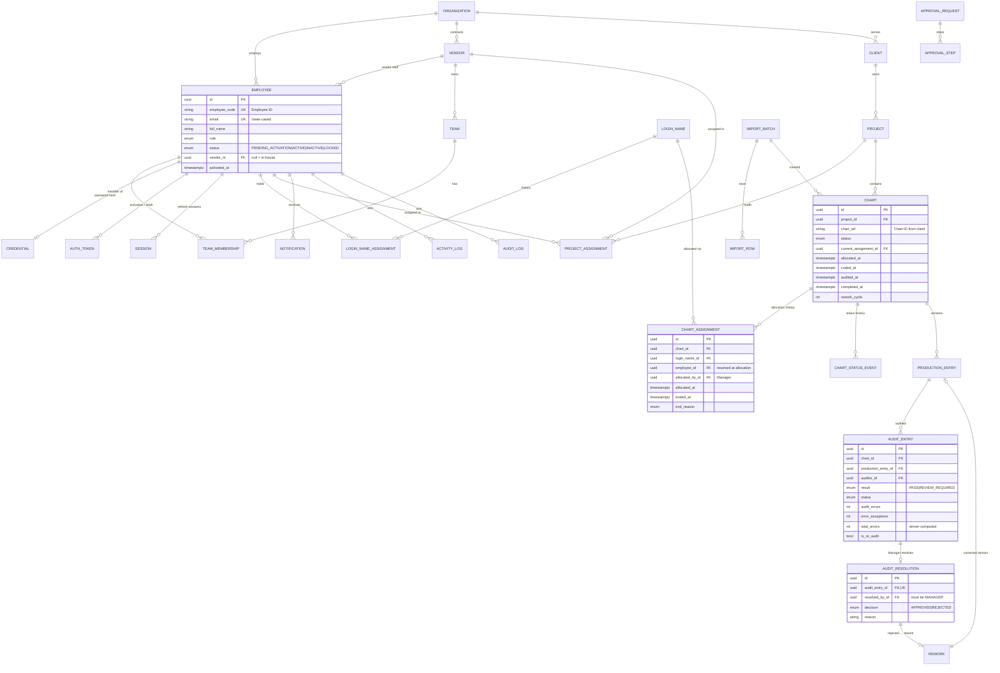

# 02 — Database Architecture

Status: **Approved (Phase 0)** — decisions D-01…D-19 applied

- **Engine**: PostgreSQL (AWS RDS; latest major version supported by RDS at Phase 2, pinned in IaC).
- **ORM / migrations**: Prisma. Constraints Prisma's schema language can't express (partial unique indexes, append-only triggers, check constraints) are written as raw SQL **inside Prisma migration files**, so `prisma migrate deploy` remains the only way schema changes reach any environment.
- **No legacy data.** The database is created empty. The only seed is system data: exactly one `Organization` (settings live in `organizations.settings`; there is no seed for employees, vendors, charts or formulas). The first Manager is created by the bootstrap command (see `06-authentication.md`), not by the seed.
- **Conventions**: table names `snake_case` plural via `@@map`; PK `id uuid` (UUIDv7); `created_at`/`updated_at` `timestamptz`; every business table carries `organization_id` (single organization in V1, multi-org-ready); foreign keys `ON DELETE RESTRICT` (nothing cascades away history).

## 1. Entity-relationship diagram (core)



## 2. Tables

### Organization & people

| Table              | Purpose                                                                                                                                   | Key constraints                                                                                                                       |
| ------------------ | ----------------------------------------------------------------------------------------------------------------------------------------- | ------------------------------------------------------------------------------------------------------------------------------------- |
| `organizations`    | SmartClues (single row in V1). Holds name, time zone, branding settings.                                                                  | —                                                                                                                                     |
| `employees`        | **Employee Directory — single source of truth** for every person (in-house and vendor). No password column.                               | `UNIQUE(organization_id, employee_code)`, `UNIQUE(lower(email))`, `CHECK` vendor roles: `role='VENDOR_ADMIN' ⇒ vendor_id IS NOT NULL` |
| `credentials`      | Argon2id password hash, `password_changed_at`, failed-attempt counter, `locked_until`. 1:1 with employee; absent until activation.        | `UNIQUE(employee_id)`                                                                                                                 |
| `auth_tokens`      | Activation and password-reset tokens. Stores **SHA-256 hash only**, `type`, `expires_at`, `used_at`, `revoked_at`, `issued_by_id`.        | Partial `UNIQUE(employee_id, type) WHERE used_at IS NULL AND revoked_at IS NULL` (only one live token per type)                       |
| `sessions`         | Refresh-token sessions: token hash, family ID (rotation/reuse detection), IP, user agent, `expires_at`, `revoked_at`.                     | `UNIQUE(token_hash)`                                                                                                                  |
| `vendors`          | Vendor companies. Status ACTIVE/INACTIVE. (User-facing terminology such as **SPC** comes from a terminology map, not table names — D-16.) | `UNIQUE(organization_id, lower(name))`, `UNIQUE(code)`                                                                                |
| `teams`            | Teams, in-house (`vendor_id` null) or vendor-owned. `team_lead_id`.                                                                       | `UNIQUE(organization_id, vendor_id, lower(name))`; TL must belong to same vendor scope (service + trigger check)                      |
| `team_memberships` | Append-only membership history.                                                                                                           | Partial `UNIQUE(employee_id) WHERE ended_at IS NULL` (one current team)                                                               |

### SmartClues Login Names

| Table                    | Purpose                                                                                                                                                   | Key constraints                                                                                                                                                                                 |
| ------------------------ | --------------------------------------------------------------------------------------------------------------------------------------------------------- | ----------------------------------------------------------------------------------------------------------------------------------------------------------------------------------------------- |
| `login_names`            | Internal SmartClues identifiers (value, status).                                                                                                          | `UNIQUE(organization_id, lower(value))`                                                                                                                                                         |
| `login_name_assignments` | Append-only history: login name ↔ employee, `assigned_by_id`, `assigned_at`, `ended_at`, `end_reason` (`REASSIGNED`, `DEACTIVATED`, `EMPLOYEE_INACTIVE`). | Partial `UNIQUE(login_name_id) WHERE ended_at IS NULL` **and** partial `UNIQUE(employee_id) WHERE ended_at IS NULL` → one active login name per employee and vice versa, enforced by PostgreSQL |

### Clients, projects, staffing

| Table                 | Purpose                                                                                                                                          | Key constraints                                                                                                                                |
| --------------------- | ------------------------------------------------------------------------------------------------------------------------------------------------ | ---------------------------------------------------------------------------------------------------------------------------------------------- |
| `clients`             | Client name, status.                                                                                                                             | `UNIQUE(organization_id, lower(name))`                                                                                                         |
| `projects`            | `client_id`, name, `allocation_type` (`MANUAL`/`AUTOMATIC`), status. Audit coverage is 100 % in V1 (D-02) — no sampling columns.                 | `UNIQUE(client_id, lower(name))`                                                                                                               |
| `project_assignments` | Who works on a project: an employee (with project role `TEAM_LEAD`/`AUDITOR`/`CODER`/`GROUP_COACH`) or a whole vendor. Append-only (`ended_at`). | Partial `UNIQUE(project_id, employee_id, project_role) WHERE ended_at IS NULL`; partial `UNIQUE(project_id, vendor_id) WHERE ended_at IS NULL` |

### Charts, production, audit

| Table                 | Purpose                                                                                                                                                                                                                                                             | Key constraints                                                                                                                                                  |
| --------------------- | ------------------------------------------------------------------------------------------------------------------------------------------------------------------------------------------------------------------------------------------------------------------- | ---------------------------------------------------------------------------------------------------------------------------------------------------------------- |
| `charts`              | One row per chart. `chart_ref` = Chart ID from the client file; denormalised tracking columns (`allocated_at`, `coded_at`, `audited_at`, `completed_at`, `status`, `current_assignment_id`) for fast tracking screens; `source_data jsonb` keeps extra CSV columns. | `UNIQUE(project_id, chart_ref)` (D-04); index `(project_id, status)`, `(status, allocated_at)`                                                                   |
| `chart_assignments`   | **The only allocation mechanism.** Login name + resolved employee, `source` (`MANUAL`/`CSV`/`AUTOMATIC`), who allocated, when, when ended and why.                                                                                                                  | Partial `UNIQUE(chart_id) WHERE ended_at IS NULL` → **a chart can never be allocated twice**                                                                     |
| `chart_status_events` | Append-only status history (`from`, `to`, actor, reason, at). Feeds the chart timeline.                                                                                                                                                                             | Insert-only trigger                                                                                                                                              |
| `production_entries`  | Coder's work, **versioned**: `version`, `is_current`, coder + login name (from session, never typed), `page_count`, `total_icds`, `total_dos`, `started_at`, `submitted_at`, `active_seconds`, `remarks`, `rework_id`. Submitted versions are immutable.            | `UNIQUE(chart_id, version)`; partial `UNIQUE(chart_id) WHERE is_current`                                                                                         |
| `audit_entries`       | One row per audit (re-audits are new rows). Auditor from session; `audit_errors`, `error_exceptions` (two separate columns), `total_errors` (PostgreSQL generated column = sum), `result`, `status`, `is_re_audit`, `cycle`. Immutable after submit.                | Partial `UNIQUE(production_entry_id) WHERE status IN ('IN_PROGRESS','REVIEW_REQUIRED')` (one open audit); `CHECK(audit_errors >= 0 AND error_exceptions >= 0)`   |
| `audit_resolutions`   | Manager decision on a `REVIEW_REQUIRED` audit: `APPROVED` (→ chart COMPLETED) or `REJECTED` (→ REWORK), mandatory reason on reject.                                                                                                                                 | `UNIQUE(audit_entry_id)`; resolver role checked in service **and** by a DB trigger (`resolved_by` must be an ACTIVE `MANAGER` and not the auditor of that entry) |
| `reworks`             | Rejected audit → rework: assigned coder, status (`OPEN`, `IN_PROGRESS`, `SUBMITTED`, `CLOSED`), corrected production version, cycle number.                                                                                                                         | Partial `UNIQUE(chart_id) WHERE status <> 'CLOSED'`                                                                                                              |

### Imports & files

| Table            | Purpose                                                                                                                                                                                                                                                          |
| ---------------- | ---------------------------------------------------------------------------------------------------------------------------------------------------------------------------------------------------------------------------------------------------------------- |
| `import_batches` | Every CSV workflow (`CHART_IMPORT`, `LOGIN_NAME_ASSIGNMENT`, `CHART_ALLOCATION`, `EMPLOYEE_IMPORT`): S3 key, uploaded by, status (`UPLOADED → PARSED → VALIDATED → CONFIRMED → COMMITTED / FAILED / CANCELLED`), counts (total/valid/invalid/duplicate/warning). |
| `import_rows`    | Row number, raw values, normalised values, errors[], warnings[], duplicate flag, resulting entity id. Drives preview and the downloadable error report.                                                                                                          |
| `file_objects`   | Metadata for S3 objects (bucket, key, size, checksum, content type, owner, purpose).                                                                                                                                                                             |

### Workflow, notifications, logs

| Table                                  | Purpose                                                                                                                                                                                                                                                                        |
| -------------------------------------- | ------------------------------------------------------------------------------------------------------------------------------------------------------------------------------------------------------------------------------------------------------------------------------ |
| `notifications`                        | In-app notifications (recipient, type, title, link, payload, `read_at`).                                                                                                                                                                                                       |
| `outbox_messages`                      | Transactional outbox for emails/events (type, payload, status, attempts, `next_attempt_at`).                                                                                                                                                                                   |
| `approval_requests` / `approval_steps` | **Universal Approval Engine**: request type, subject (`entity_type`, `entity_id`), requested change (jsonb), requester, status; ordered steps with approver role/person and decision. Used e.g. for login-name changes, employee deactivation, project closure (configurable). |
| `activity_logs`                        | Human-readable timeline ("Manager X allocated 120 charts to Login Name Y").                                                                                                                                                                                                    |
| `audit_logs`                           | Compliance log: actor, action, entity, before/after jsonb, IP, request ID. **Append-only** — `UPDATE`/`DELETE` blocked by trigger and DB role grants.                                                                                                                          |

### Productivity, settings, later phases

| Table                 | Purpose                                                                                                                                            |
| --------------------- | -------------------------------------------------------------------------------------------------------------------------------------------------- |
| `cph_formulas`        | Versioned CPH definition (D-10) so the formula changes without a code deploy; reports record which version they used.                              |
| `settings`            | Org-level key/value settings (token lifetimes, working hours, terminology labels such as SPC).                                                     |
| `hr_links`            | Reserved for the Smart HRMS adapter (D-09). Identity is matched on **Employee ID**. Not created until the real HRMS API specification is provided. |
| `visitors` / `visits` | Visitor Management (Phase 12, scope D-07).                                                                                                         |
| `internal_audit_*`    | Internal Audit workspace (Phase 12, scope D-07).                                                                                                   |

## 3. Enums

```text
Role                 MANAGER | HR | GROUP_COACH | TEAM_LEAD | AUDITOR | CODER | VENDOR_ADMIN
EmployeeStatus       PENDING_ACTIVATION | ACTIVE | INACTIVE | LOCKED
AuthTokenType        ACTIVATION | PASSWORD_RESET
AllocationType       MANUAL | AUTOMATIC
ProjectRole          TEAM_LEAD | AUDITOR | CODER | GROUP_COACH
ChartStatus          PENDING_ALLOCATION | ALLOCATED | IN_PRODUCTION | CODED | PENDING_AUDIT
                     | REVIEW_REQUIRED | REWORK | RE_AUDIT | AUDITED | COMPLETED
AllocationSource     MANUAL | CSV | AUTOMATIC
ProductionStatus     DRAFT | SUBMITTED | SUPERSEDED
AuditResult          PASS | REVIEW_REQUIRED
AuditStatus          IN_PROGRESS | PASSED | REVIEW_REQUIRED | APPROVED | REJECTED
ResolutionDecision   APPROVED | REJECTED
ReworkStatus         OPEN | IN_PROGRESS | SUBMITTED | CLOSED
AssignmentEndReason  REALLOCATED | DEALLOCATED | EMPLOYEE_INACTIVE
ImportType           CHART_IMPORT | LOGIN_NAME_ASSIGNMENT | CHART_ALLOCATION | EMPLOYEE_IMPORT
ImportStatus         UPLOADED | PARSED | VALIDATED | CONFIRMED | COMMITTED | FAILED | CANCELLED
ApprovalStatus       PENDING | APPROVED | REJECTED | CANCELLED
```

**Role is a PostgreSQL enum; permissions are code.** The role → permission matrix lives in `packages/shared/rbac` (versioned, reviewed in PRs, tested against every endpoint). A configurable role table is possible later but makes the security model harder to test.

## 4. Indexing strategy

- Every foreign key indexed.
- Tracking & queues: `charts(project_id, status)`, `charts(status, updated_at)`, `chart_assignments(employee_id) WHERE ended_at IS NULL`, `audit_entries(status, created_at)`, `reworks(status)`.
- Directory search: `employees(organization_id, role, status)`, trigram (`pg_trgm`) GIN on `full_name`, `email`, `employee_code`; on `charts.chart_ref` and `login_names.value`.
- Vendor scope: composite indexes start with `vendor_id` where vendor-scoped lists are hot (`employees(vendor_id, status)`, `teams(vendor_id)`).
- Reports: `production_entries(submitted_at)`, `audit_entries(submitted_at)`; heavier aggregates move to materialised views refreshed by the worker if needed (decided in Phase 11 with real volumes).

## 5. Integrity rules enforced by the database (not only by code)

1. Employee ID unique; email unique (case-insensitive).
2. One active login name per employee; one active employee per login name.
3. A chart has at most one active allocation (no duplicate allocation).
4. Chart ID unique within its project.
5. One current production version per chart; one open audit per production version; one open rework per chart.
6. Audit resolution only by an active Manager who is not the auditor (trigger) and only once per audit.
7. `total_errors` is set by a `BEFORE INSERT` trigger from `audit_errors + error_exceptions` (any client-supplied value is overwritten) and guarded by a `CHECK`, so it can never disagree. (Implemented as trigger + CHECK rather than a generated column so the sequence/previous-audit logic shares one trigger.)
8. `audit_logs` and `*_events` / history tables are append-only.
9. Live activation/reset tokens: at most one per employee per type.

## 5a. Phase 2 as-built notes

The implemented model is authoritative where it differs from the sketches above (see `phases/phase-2.md` for the full table list).

- **Tables (26):** organizations, employees, credentials, auth_tokens, sessions, vendors, teams, team_memberships, login_names, login_name_assignments, clients, projects, project_assignments, charts, chart_status_transitions, chart_status_events, chart_allocations, production_entries, audits, audit_resolutions, reworks, notifications, approval_requests, approval_steps, activity_logs, audit_logs.
- **Deferred to the phases that use them:** import_batches/import_rows (CSV), file_objects, outbox, cph_formulas, hr_links, visitors.
- **Soft-delete:** status-based deactivation. `sc_forbid_delete` blocks DELETE on core tables, `sc_append_only` blocks UPDATE/DELETE on logs and history, `sc_forbid_truncate` blocks TRUNCATE. Only DRAFT production entries and credential/token/session/notification rows are purgeable.
- **Rule errors:** triggers raise custom SQLSTATEs which the API maps to HTTP: `SC403` → 403, `SC409` → 409, `SC422` → 422.
- **Chart status** may only change along `chart_status_transitions` (mirrored from the shared `CHART_TRANSITIONS`, asserted equal by a test) and only with backing facts (allocation, submitted production version, audit result, open rework). Actor and reason come from transaction-local `app.actor_id` / `app.reason` (`withActor`).
- **Audit:** one audit per production version (`UNIQUE(production_entry_id)`); `sequence`, `previous_audit_id`, `is_re_audit` computed by trigger; status moves to APPROVED/REJECTED only through an `audit_resolutions` row (Manager-only, not the auditor, once).
- **Project eligibility:** a vendor employee may be assigned/allocated only on projects with the same `vendor_id`; in-house coders need a direct CODER project assignment.
- **Log safety:** `sc_json_has_forbidden_key` rejects credential/PHI-like keys in log metadata; the TypeScript redactor mirrors it (a test proves they agree).
- **Open point for Manager:** which roles may hold a Login Name (currently any active employee eligible for production or audit work).

### Service transaction recipes

1. Reallocate: end old allocation (`ENDED`) → insert new `ACTIVE` allocation → set chart status, all in one `withActor` transaction.
2. Production submit/correction: mark prior current entry `SUPERSEDED` → insert new version.
3. Resolution: insert `audit_resolutions` → (trigger updates audit) → create rework if rejected → set chart status.

## 6. Healthcare data posture (D-05)

SmartCode is designed as a healthcare application that **may** hold identifiable US medical information:

- Encryption in transit (TLS to RDS/Redis/S3, `sslmode=require`) and at rest (RDS/S3/Redis with KMS).
- Imported extra columns land in `charts.source_data` only if the column is on the project's **allow-list**; everything else is dropped at parse time and never logged.
- Raw uploaded CSVs live in S3 (KMS, retention lifecycle), not in PostgreSQL; `import_rows.raw` is purged after commit + retention period.
- Least-privilege DB roles: runtime role (DML only, no DDL, no `UPDATE/DELETE` on log tables), migration role (DDL), read-only reporting role.
- Development, test, CI and staging use **synthetic data only**; seeds and fixtures never contain patient data.
- No claim of "HIPAA compliance" is made by the software; the production AWS environment must be reviewed/configured (BAA, HIPAA-eligible services, access monitoring) before real PHI is introduced.

## 7. Connection handling

API tasks use one Prisma client per process with a bounded pool (`connection_limit` sized so `tasks × pool ≤ 70 %` of RDS `max_connections`). Migrations run as a one-off ECS task, never at API start-up. RDS Proxy is not needed for Fargate at expected scale; revisit if tasks scale beyond the pool budget.

## 8. Database automation (no manual SQL)

| Command (Phase 1–2)      | What it does                                                                                                                                               |
| ------------------------ | ---------------------------------------------------------------------------------------------------------------------------------------------------------- |
| `pnpm db:migrate`        | `prisma migrate deploy` against the configured `DATABASE_URL`                                                                                              |
| `pnpm db:migrate:dev`    | create/apply migrations locally                                                                                                                            |
| `pnpm db:seed`           | idempotent system seed (one organization only)                                                                                                             |
| `pnpm db:reset`          | **local only** — refuses unless `APP_ENV=development` and host is localhost                                                                                |
| `pnpm db:health`         | connection, latency, migrations applied, pending migrations                                                                                                |
| `pnpm db:verify`         | required tables/enums/indexes/partial uniques/triggers exist; seed present; orphan & duplicate checks; in fresh deployments reports `Business data: CLEAN` |
| `pnpm bootstrap:manager` | creates the first Manager (pending activation) and emails the activation link                                                                              |

Example `db:verify` output:

```
DATABASE VERIFY  (env=staging)
------------------------------
Connection ............ PASS  (12 ms)
Migrations ............ PASS  (14 applied, 0 pending, 0 failed)
Required tables ....... PASS  (31/31)
Enums ................. PASS
Unique/partial indexes  PASS  (18/18)
Triggers .............. PASS  (append-only, resolver-is-manager)
Foreign keys / orphans  PASS
Duplicates ............ PASS
System seed ........... PASS
Business data ......... CLEAN (0 employees besides bootstrap manager, 0 charts)
```
