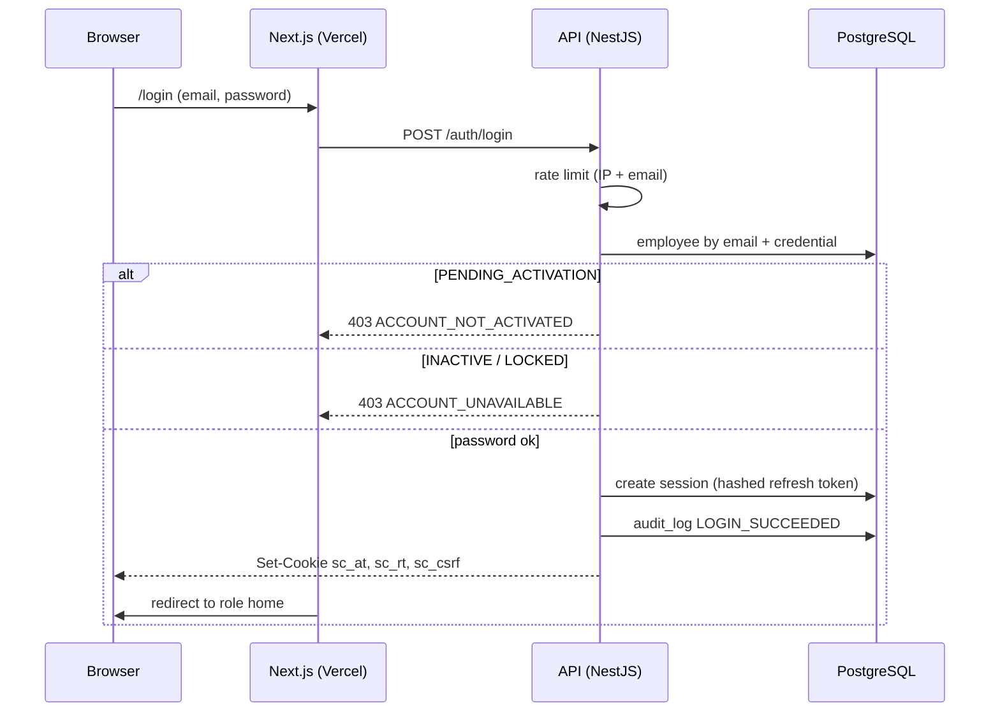
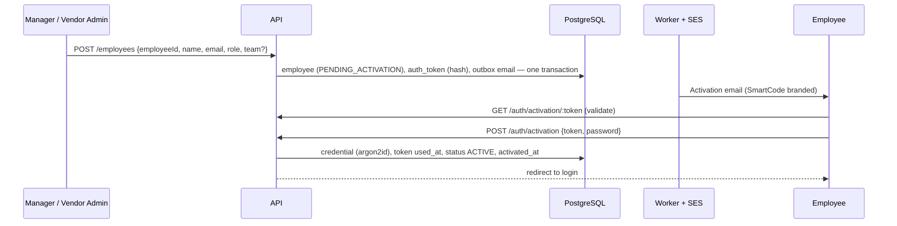

# 06 — Authentication Architecture

Status: **Approved (Phase 0)** — final decisions applied

**Email + password** only. No login-name login, phone login, Firebase Auth or social login.

## 1. Components

| Piece                | Design                                                                                                                                                                                    |
| -------------------- | ----------------------------------------------------------------------------------------------------------------------------------------------------------------------------------------- |
| Password hashing     | **Argon2id** (memory-hard; parameters tuned to ~250 ms on the API task size). Stored in `credentials`, never in `employees`.                                                              |
| Password policy      | Min 6 characters; rejects passwords containing the email/name; strength check (zxcvbn score ≥ 3); optional breached-password check (k-anonymity) — D-17.                                  |
| Access token         | JWT, **15 min**, signed **ES256** with key ID (`kid`) for rotation. Claims: `sub`, `role`, `vid` (vendor), `sid` (session), `pv` (permissions version).                                   |
| Refresh token        | Opaque 256-bit random, **SHA-256 hashed** in `sessions`; rotated on every refresh; **reuse detection** revokes the whole token family. Idle timeout 12 h, absolute 7 days (configurable). |
| Browser storage      | `httpOnly; Secure; SameSite=Lax` cookies on the shared parent domain: `sc_at` (access), `sc_rt` (refresh, `Path=/api/v1/auth`). No tokens in `localStorage`.                              |
| CSRF                 | SameSite=Lax + double-submit token (`sc_csrf` readable cookie echoed in `X-CSRF-Token`) + `Origin` allow-list check.                                                                      |
| Immediate revocation | Each request checks the session's `revoked_at` and the employee's status via a Redis cache (≤ 30 s TTL), so deactivation/reset takes effect within seconds, not at token expiry.          |
| Brute force          | Rate limits per IP and per email; 5 failed attempts → 15 min lock (`LOCKED` + `locked_until`); generic error messages.                                                                    |
| Mobile (V2)          | Same endpoints in bearer mode; refresh token kept in secure device storage.                                                                                                               |

This requires the web app and API to share a registrable domain (e.g. `app.example.com` + `api.example.com`) — see D-06.

## 2. Activation & reset tokens

- 32 random bytes (base64url) → sent only by email in a link (`https://app.<domain>/activate?token=…`).
- Database stores **SHA-256(token)** only, with `type`, `expires_at`, `used_at`, `revoked_at`.
- **Single use**: consumed in the same transaction that sets the password (`UPDATE … WHERE used_at IS NULL AND expires_at > now()` — race-safe).
- **Expiry**: activation 72 h, reset 30 min (settings).
- Issuing a new token revokes any previous live token of the same type.
- Successful activation/reset revokes all sessions and invalidates all other tokens of that employee.
- Responses never reveal whether an email exists (`/password/forgot` always `202`).
- Token values never appear in logs, API responses, the Manager UI or the audit log.

## 3. Flows

### Login



### Employee creation → activation



### Forgot password / Manager-triggered reset

Either the employee (`/password/forgot`) or a Manager/Vendor Admin (`POST /employees/:id/password-reset`) creates a reset token. The link is emailed **to the employee only**. On reset, all sessions are revoked and the event is audit-logged (who triggered it, never the password).

## 4. Bootstrap of the first Manager (no hard-coded passwords)

```
BOOTSTRAP_MANAGER_EMAIL=… BOOTSTRAP_MANAGER_NAME=… BOOTSTRAP_MANAGER_EMPLOYEE_ID=… pnpm bootstrap:manager
```

- Runs as a one-off ECS task (or locally against dev).
- Refuses to run if any active Manager already exists (idempotent, safe to re-run).
- Creates the Manager as `PENDING_ACTIVATION` and emails an activation link — **no password exists anywhere** until the Manager sets one in the browser.
- Writes `audit_log` `BOOTSTRAP_MANAGER_CREATED` (actor: system).
- For local development only, `--print-link` prints the link to the terminal; it is refused when `APP_ENV` is `staging` or `production`.

## 5. Authorization hand-off

After authentication, every request passes the permission guard and scope layer described in `03-rbac-matrix.md`. The frontend uses `GET /auth/me` permissions only to show/hide UI; the API re-checks everything.

## 6. Implementation notes (Phase 3)

Implemented in `apps/api/src/core/auth` and `apps/api/src/modules/auth`.

- **Tokens and cookies.** ES256 access JWT (15 min) whose `sid` is the session family; opaque refresh token (SHA-256 in `sessions`, rotated on every use, reuse of a spent token revokes the whole family). Cookies: `sc_at` (httpOnly), `sc_rt` (httpOnly, `Path=/api/v1/auth`), `sc_csrf` (readable; echoed in `X-CSRF-Token`). Bearer callers are exempt from CSRF. In production set `COOKIE_DOMAIN` to the shared parent domain so the web app can read `sc_csrf`.
- **Every request is checked against the database.** `AuthGuard` → `SessionService.verify`: the session family must be live, the employee must be ACTIVE, and role and vendor are re-read. Logout, deactivation, a password change/reset and a role change therefore apply to the very next request, not when the 15-minute token expires.
- **Passwords.** Argon2id. Policy (`packages/shared/password-policy`): 6–128 characters, not a common password, must not contain the person’s name parts, email name or Employee ID; the web form and the API apply the same function.
- **Sign-in.** Email + password only; a Login Name is rejected as input. PENDING_ACTIVATION always gets the generic 401 (the response never says the account exists). INACTIVE with the correct password gets 403 `ACCOUNT_UNAVAILABLE`. Five failures lock the credential for 15 minutes (429); a per-email+IP failure limiter (in-memory per API task, Redis later) sits on top, and only failures are counted so an office behind one address can still sign in.
- **Links.** Activation (72 h) and reset (30 min) tokens are 256-bit random, stored as SHA-256, consumed atomically (`UPDATE … WHERE used_at IS NULL`), and issuing a new link revokes the live one. Any bad link — unknown, used, revoked, expired, wrong type, wrong account state — answers the same 400 `TOKEN_INVALID`. `POST /auth/tokens/check` answers `{valid}` so the page can say so before the person types.
- **Reset.** Only ACTIVE accounts. `POST /auth/password/forgot` always answers 202 `{accepted:true}` and sends nothing to unknown, pending or inactive addresses; a pending person must use the activation link. A Manager may send a reset link (`employee.triggerPasswordReset`) but never sets or sees a password.
- **Revocation.** Password change keeps the current session and revokes the others; reset and activation revoke all; deactivation revokes all.
- **Bootstrap.** `pnpm bootstrap:manager` (env: `BOOTSTRAP_MANAGER_EMAIL`, `_NAME`, `_EMPLOYEE_ID`): creates a PENDING Manager and emails the activation link. Re-running after activation does nothing; re-running while pending re-issues the link; a pending Manager under a different email is refused rather than duplicated. `--print-link` is local-development only and refused when `APP_ENV` is staging or production. The database additionally refuses to demote or deactivate the last active Manager.
- **Mail.** `MailService` renders the branded templates in `packages/email-templates` and builds every link from `WEB_URL`. Failure to send never fails a committed operation; only the category and outcome are logged, never the link or address.
