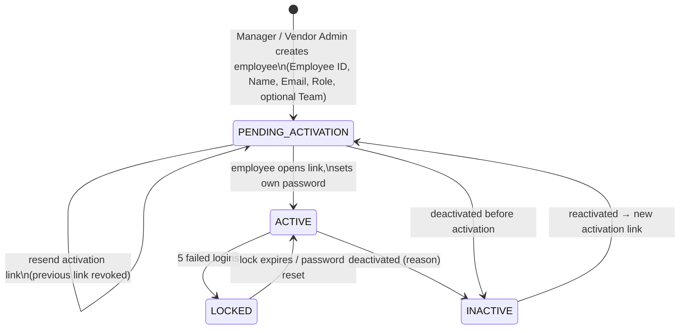

# 07 — Employee Lifecycle

Status: **Approved (Phase 0)** — final decisions applied

## Rules

1. **Creation** — Manager can create any role (incl. other Managers, HR, Group Coach, TL, Auditor, Coder) and Vendor Admin accounts (via Vendor Management). Vendor Admin can create TL/Auditor/Coder **inside their own vendor only**. Nobody sets a password for someone else.
2. **Required fields** — Employee ID (unique), Employee Name, Email (unique, case-insensitive), Role. Optional: Team (must be in the same vendor scope).
3. **Activation** — single-use, expiring (72 h), hashed token; invalid after success; resend revokes the previous link.
4. **Login Name** — unassigned at creation. Only a Manager assigns a SmartClues Login Name (manual or CSV) after the employee exists. An employee can be activated before or after a login name is assigned; only employees with an active login name can receive charts.
5. **Team / project** — team membership and project assignments are history tables (moving a person closes the old row, opens a new one).
6. **Deactivation** — revokes sessions immediately; ends active login-name assignment (`EMPLOYEE_INACTIVE`) — **Manager is warned first if the person still has allocated charts or open rework, and must reallocate or confirm** (D-12).
7. **Reactivation** — returns to `PENDING_ACTIVATION` and issues a new activation link (forces a fresh password).
8. **Directory** — the Employee Directory is the only employee master. HR integration links to it; it does not create a second employee list.
9. **Audit trail** — every lifecycle event is in `audit_logs` (who, when, before/after), visible in the employee's timeline.
