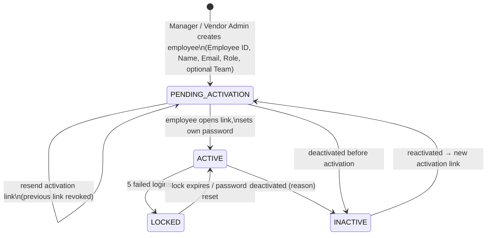

# 07 — Employee Lifecycle

Status: **Approved (Phase 0)** — final decisions applied

## Rules

1. **Creation** — Manager can create any role (incl. other Managers, HR, Group Coach, TL, Auditor, Coder) and Vendor Admin accounts (via Vendor Management). Vendor Admin can create TL/Auditor/Coder **inside their own vendor only**. Nobody sets a password for someone else.
2. **Required fields** — Employee ID (unique), Employee Name, Email (unique, case-insensitive), Role. Optional: Team (must be in the same vendor scope).
3. **Activation** — single-use, expiring (72 h), hashed token; invalid after success; resend revokes the previous link.
4. **Login Name** — unassigned at creation. Only a Manager assigns a SmartClues Login Name (manual or CSV) after the employee exists. An employee can be activated before or after a login name is assigned; only employees with an active login name can receive charts.
5. **Team / project** — team membership and project assignments are history tables (moving a person closes the old row, opens a new one).
6. **Deactivation** — revokes sessions immediately; ends active login-name assignment (`EMPLOYEE_INACTIVE`) — **Manager is warned first if the person still has allocated charts or open rework, and must reallocate or confirm** (D-12).
7. **Reactivation** — returns to `PENDING_ACTIVATION` and issues a new activation link (forces a fresh password).
8. **Directory** — the Employee Directory is the only employee master. HR integration links to it; it does not create a second employee list.
9. **Audit trail** — every lifecycle event is in `audit_logs` (who, when, before/after), visible in the employee's timeline.

## Phase 3 implementation

- **Single employee master.** The Employee Directory (`/manager/employees`, API `/employees`) is the only place employees are created or edited. Teams, Team Leads, Auditors and Coders reference existing employees.
- **Statuses.** PENDING_ACTIVATION → ACTIVE → INACTIVE. `LOCKED` exists in the enum but is not used: a lockout is a property of the credential (`failed_attempts`, `locked_until`) and clears itself. **Reactivation returns the person to PENDING_ACTIVATION**, so they choose a new password through a fresh link; nothing is ever deleted.
- **Create.** Manager supplies Employee ID, name, email, role, optional team, optional vendor (required for Vendor Admin; forbidden for Manager/HR/Group Coach). A Vendor Admin creates Team Leads, Auditors and Coders inside their own vendor only. No password, no Login Name, no placeholder email.
- **Edit.** Name and team any time; email only while PENDING_ACTIVATION (it is the sign-in identity afterwards). Role has its own Manager-only, audited operation with a mandatory reason.
- **Deactivate.** Needs a reason, revokes every session, releases the Login Name (history kept), and asks for explicit confirmation when open work exists.
- **Role change.** Manager-only. If the new role is not Login-Name-eligible the active assignment is ended explicitly with reason `ROLE_CHANGED` by a database trigger — it never stays silently usable and the history row is kept.
- **Login Names.** Eligible roles: Coder, Auditor, Team Lead, Group Coach/SME. Manager, HR and Vendor Admin do not use one. Only an ACTIVE employee can receive one; one active name per employee, one active employee per name; assigning a new name ends the previous one. Assignment (single, release and CSV) is Manager-only; reading follows the employee scope. Eligibility is enforced by a PostgreSQL trigger, so no code path can bypass it. A Login Name is an operational identifier — authentication is always email + password.
- **Bulk CSV.** `Employee Name, Employee ID, Email, Role` only (Password, Team and Login Name columns are rejected). Stateless: preview (nothing written) then commit (re-validated, so a row that became a duplicate in between is not created twice). Both rows of a repeated Employee ID/email are flagged. Modes: valid-only or all-or-nothing. Formula-trigger values (`= + - @`) are rejected. Importing does not email anyone; sending activation links is a separate step (bulk or per person).
- **Login Name CSV.** `Employee Email, Login Name`. Detects unknown email, inactive, pending, ineligible role, duplicate or already-assigned Login Name, and a repeated employee; warns when a name would replace the current one.
