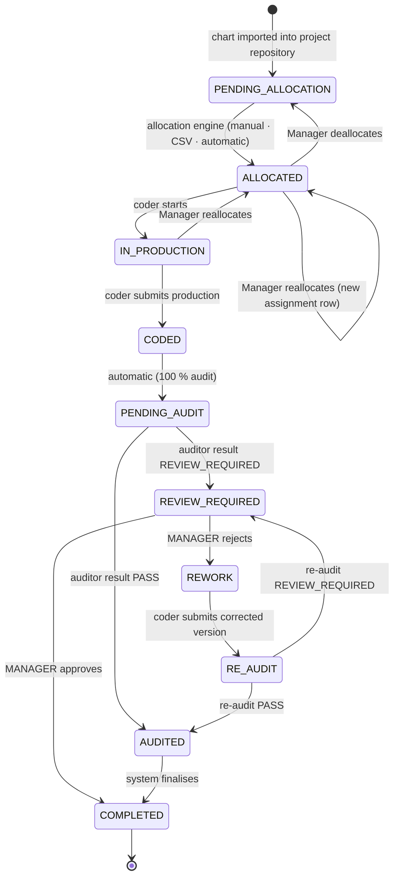

# 08 — Chart Lifecycle

Status: **Approved (Phase 0)** — decisions D-01, D-02, D-03, D-04 are final.

## 1. End-to-end flow

```
CLIENT → PROJECT → CHART REPOSITORY → CHART ALLOCATION → CODER PRODUCTION → AUDIT (100 %) → (REVIEW → REWORK → RE-AUDIT)* → COMPLETED
```

## 2. Chart statuses

| Status               | Meaning                                                                             |
| -------------------- | ----------------------------------------------------------------------------------- |
| `PENDING_ALLOCATION` | Imported into the project's repository, not yet allocated                           |
| `ALLOCATED`          | Allocated to a SmartClues Login Name (and therefore its coder)                      |
| `IN_PRODUCTION`      | Coder has started work                                                              |
| `CODED`              | Coder submitted production (transient — immediately enters the audit queue)         |
| `PENDING_AUDIT`      | In the audit queue. **Every coded chart** (D-02: 100 % coverage, no sampling in V1) |
| `REVIEW_REQUIRED`    | Auditor flagged the audit for **Manager review**                                    |
| `REWORK`             | Manager rejected the review; corrected production required                          |
| `RE_AUDIT`           | Corrected production submitted; waiting for re-audit                                |
| `AUDITED`            | Audit passed (audited date recorded)                                                |
| `COMPLETED`          | Final                                                                               |

## 3. State machine



- `CODED → PENDING_AUDIT` and `AUDITED → COMPLETED` happen automatically inside the same transaction as the triggering action; both transitions are still recorded in the chart's history so the Coded Date and Audited Date are always captured.

## 4. Transition authority

| Transition                              | Who                             | Notes                                                                                                  |
| --------------------------------------- | ------------------------------- | ------------------------------------------------------------------------------------------------------ |
| import → `PENDING_ALLOCATION`           | Manager                         | CSV framework only                                                                                     |
| → `ALLOCATED` / reallocate / deallocate | **Manager only**                | One engine; target must be an eligible coder (below)                                                   |
| `ALLOCATED → IN_PRODUCTION → CODED`     | Allocated coder                 | Identity from session                                                                                  |
| `PENDING_AUDIT` / `RE_AUDIT` → result   | Auditor assigned to the project | Never the chart's own coder                                                                            |
| `REVIEW_REQUIRED → COMPLETED / REWORK`  | **Manager only**                | Team Lead, Group Coach/SME, Auditor (incl. the auditor who raised it), Coder, Vendor Admin, HR → `403` |
| `REWORK → RE_AUDIT`                     | Rework assignee (coder)         |                                                                                                        |

All other transitions are rejected (`409 INVALID_TRANSITION`). The transition table lives in `packages/shared/src/workflow/chart.ts` and is used by both API and web.

## 5. One Chart Allocation Engine (D-03)

`ChartAllocationService.allocate(requests[], source)` is the single write path. Three entry points call it:

| Source      | Input                                                                                                    |
| ----------- | -------------------------------------------------------------------------------------------------------- |
| `MANUAL`    | Manager selects chart(s) + Login Name                                                                    |
| `CSV`       | `Chart ID, Login Name` file through the CSV framework                                                    |
| `AUTOMATIC` | Manager selects a project and eligible coders → the engine computes a **balanced plan** and allocates it |

**Eligibility** (checked for every source): employee `ACTIVE`; holds a valid active SmartClues Login Name; role `CODER`; assigned to the project (directly, via team, or via the project's vendor assignment); not disabled.

**Balanced workload (automatic):** for each eligible coder, current load = charts in `ALLOCATED` + `IN_PRODUCTION` + `REWORK`. Charts (oldest first) are assigned one at a time to the coder with the lowest current load (ties → least recently allocated, then Employee ID), so the final spread differs by at most one chart. The plan is shown as a preview before the Manager confirms. Every allocation row records `source`.

## 6. Tracking (Manager view)

Searchable by **Chart ID** (unique within a project — D-04: `UNIQUE(project_id, chart_ref)`):

| Column              | Source                                                          |
| ------------------- | --------------------------------------------------------------- |
| Chart ID            | `charts.chart_ref`                                              |
| Assigned Date       | current `chart_assignments.allocated_at`                        |
| Assigned Login Name | current assignment → `login_names.value`                        |
| Employee Email      | login-name holder at allocation time (stored on the assignment) |
| Coded Date          | `charts.coded_at`                                               |
| Audited Date        | `charts.audited_at`                                             |
| Current Status      | `charts.status`                                                 |

Plus the chart timeline (status events, assignments, production versions, audits, resolutions, reworks).

## 7. Guarantees

- No duplicate allocation: partial unique index `chart_assignments(chart_id) WHERE ended_at IS NULL`.
- Allocations are never overwritten: reallocation ends the old row and inserts a new one in one transaction.
- Every status change writes `chart_status_events` + `audit_logs` in the same transaction.
