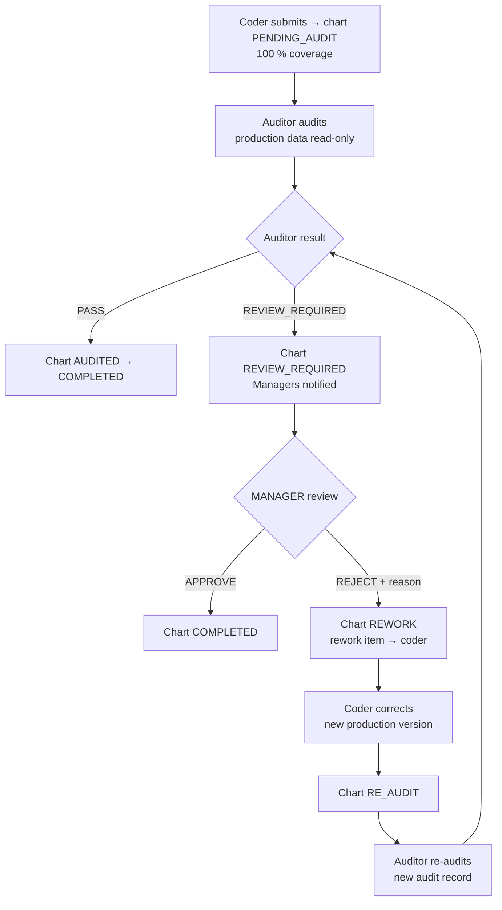
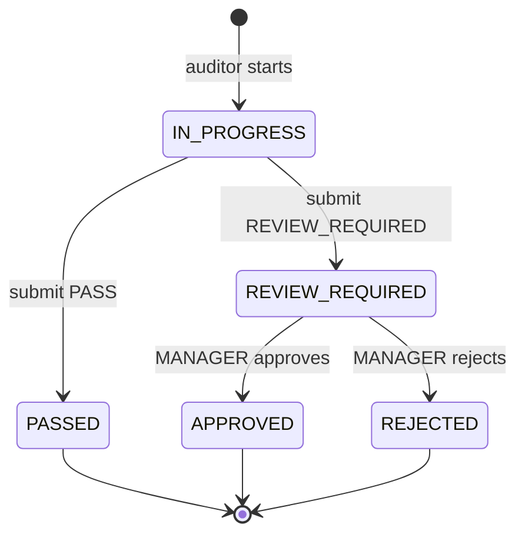

# 09 — Audit, Manager Review, Rework & Re-Audit

Status: **Approved (Phase 0)** — decision D-01 is final.

## 1. Rule

**Only a MANAGER resolves `REVIEW_REQUIRED`.**

| Role | Allowed |
|---|---|
| Auditor | Performs the audit (PASS or REVIEW_REQUIRED). **Cannot resolve their own REVIEW_REQUIRED decision.** |
| Manager | Approves (→ COMPLETED) or rejects (→ REWORK) |
| Team Lead | Cannot resolve, approve, reject, or send an audit directly to rework → **HTTP 403** |
| Group Coach / SME | Cannot resolve audits → 403 |
| Coder, Vendor Admin, HR | Cannot resolve → 403 |

Enforced in three layers: permission guard (`audit.resolveReview` → MANAGER only) → service (audit state, resolver role, resolver ≠ auditor of that entry) → database trigger on `audit_resolutions` (resolver must be an ACTIVE MANAGER).

## 2. Flow

## 3. Audit record

## 4. Fields (D-11)

- Read-only from production: coder, login name, Page Count, ICDs, DOS, coded date.
- Entered by auditor: **Audit Errors** and **Error Exceptions** (stored as two separate columns), audit date, remarks.
- **Total Errors = Audit Errors + Error Exceptions**, computed by the server (stored as a generated column so it can never disagree with its parts).
- No JCD field anywhere.

## 5. Rules

1. Auditor identity comes from the session; auditors only see charts of their assigned projects and never their own coded charts.
2. Submitted audits are immutable; re-audit creates a new `audit_entries` row (`is_re_audit = true`, `cycle` incremented).
3. `audit_resolutions` holds one decision per audit: Manager, `APPROVED`/`REJECTED`, reason (required on reject), timestamp.
4. Reject creates a `reworks` row assigned to the coder of the rejected version (Manager may reassign); corrected work is a new production version.
5. Loop continues until PASS or Manager approval. Complete history is retained.

## 6. Required tests (Phase 9)

Manager approve → COMPLETED · Manager reject → REWORK + rework item · Team Lead → **403** · Group Coach, Auditor (own decision), Coder, Vendor Admin, HR → 403 · second resolution → 409 · resolving a non-REVIEW_REQUIRED audit → 409 · DB trigger rejects non-Manager resolver · full loop audit → review → reject → rework → re-audit → PASS → COMPLETED with full history.
