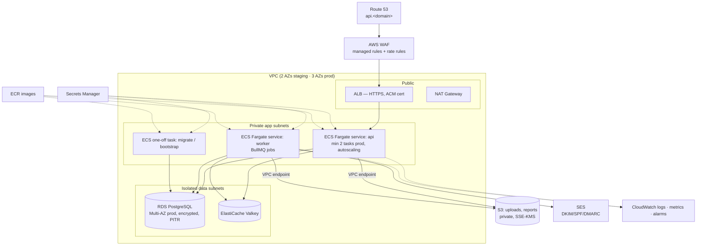

# 11 — Deployment Architecture (AWS + Vercel)

Status: **Approved (Phase 0)** — final decisions applied. Nothing is provisioned in Phase 0.

## 1. Environments

| Environment | Web | API / DB | Branch | Data |
|---|---|---|---|---|
| Development | `localhost:3000` (domains are configuration — `WEB_URL`, `API_URL`, `APP_URL`; D-06) | Local Docker: PostgreSQL, Redis, MinIO (S3), Mailpit (email) | feature branches | Throw-away local data; **never** a cloud DB |
| Staging | Vercel (Preview / `staging` alias) — `app.staging.<domain>` | AWS **staging account** — `api.staging.<domain>` | `develop` | Synthetic test data only |
| Production | Vercel Production — `app.<domain>` | AWS **production account** — `api.<domain>` | `main` | Real data; starts empty + bootstrap Manager |

Separate AWS accounts (via AWS Organizations) for staging and production: a staging credential physically cannot touch production. Each environment has its own database, buckets, secrets, SES config and keys. The API refuses to start if `APP_ENV` and the database host don't match the expected environment pattern.

## 2. AWS architecture (per environment)

| Service | Configuration |
|---|---|
| ECS Fargate | One Docker image, three modes: `api`, `worker`, `task` (migrate / bootstrap / verify). Rolling deploys with circuit-breaker auto-rollback. |
| RDS PostgreSQL | Encrypted (KMS), automated backups + PITR (7 d staging, 35 d prod), deletion protection, Multi-AZ in prod, Performance Insights, no public access. |
| ElastiCache | Valkey/Redis, TLS + auth, used for queues, rate limiting, SSE fan-out, cache. |
| S3 | `smartcode-<env>-uploads`, `smartcode-<env>-reports`; block public access; presigned URLs (5–15 min); lifecycle rules; versioning on reports. |
| SES | Domain identity with DKIM/SPF/DMARC; configuration set → SNS for bounces/complaints; **production access request** needed to leave the SES sandbox. |
| Secrets Manager | DB credentials (auto-rotation), JWT signing keys, other secrets; injected as ECS task secrets. |
| CloudWatch | Log groups (30 d staging / 1 y prod), alarms: 5xx rate, p95 latency, task health, RDS CPU/connections/storage, queue depth, SES bounce rate → SNS email. |
| WAF | AWS managed common + known-bad-inputs rules, IP rate limits on `/api/v1/auth/*`. |
| IaC | AWS CDK (TypeScript) stacks: `Network`, `Data`, `Storage`, `Email`, `Api`, `Monitoring`; `cdk diff` reviewed in PRs. |
| Region | Configurable per environment. Because SmartCode may handle US healthcare data (D-05), the production region and account setup (AWS BAA, HIPAA-eligible services only) must be reviewed **before real PHI is introduced**. Staging/dev hold synthetic data only. |

## 3. Vercel architecture

- One Vercel project, root `apps/web`, framework Next.js, Node 24.
- **Preview** deployments for every PR → point at the **staging** API.
- `develop` → staging domain alias; `main` → Production.
- Environment variables scoped per Vercel environment (Development / Preview / Production); only `NEXT_PUBLIC_*` values reach the browser, and none of them are secrets.
- Security headers (CSP, HSTS, frame-ancestors none, referrer policy) in `next.config`.
- Brand assets served from `/brand/*`, favicons from `/`.

## 4. CI/CD (GitHub Actions)

```mermaid
flowchart LR
  PR[Pull request] --> CI["ci.yml<br/>install · lint · typecheck · unit · integration (PostgreSQL service) · build · e2e (docker compose)"]
  CI --> MERGE_D[merge → develop]
  MERGE_D --> STG[deploy-staging.yml]
  STG --> S1[build + push image to ECR]
  S1 --> S2[run migrate task<br/>prisma migrate deploy]
  S2 --> S3[run db:verify task]
  S3 --> S4[update ECS services<br/>wait for healthy]
  S4 --> S5["Vercel deploy (staging)"]
  S5 --> S6[smoke tests + E2E against staging]
  S6 --> MERGE_M[merge develop → main]
  MERGE_M --> PRD[deploy-production.yml<br/>GitHub Environment: manual approval]
  PRD --> P1[same image digest promoted]
  P1 --> P2[migrate → verify → ECS deploy → Vercel prod → smoke]
```

- AWS access via **GitHub OIDC** role per environment — no AWS keys in GitHub.
- Production deploy requires a reviewer approval (GitHub Environment protection).
- The **same image digest** that passed staging is promoted to production.
- Migrations follow **expand → migrate → contract**, so the previous API version keeps working during a rolling deploy; destructive changes ship in a later release.
- Rollback: ECS circuit breaker auto-rolls back unhealthy deploys; `request-rollback` workflow redeploys the previous digest; Vercel instant rollback for web. Database rollbacks are forward-fix migrations (PITR for disasters).

## 5. First production deployment (once Phase 13 passes)

1. `cdk deploy` all stacks to the production account (reviewed diff).
2. Verify SES domain + production access; DNS records in Route 53.
3. CI production workflow: image → `migrate` task → `db:verify` (expects `Business data: CLEAN`) → API service → Vercel production.
4. `bootstrap:manager` one-off task with `BOOTSTRAP_MANAGER_*` values → Manager receives activation email and sets the password in the browser.
5. `pnpm smoke:production` against `PRODUCTION_URL` / `PRODUCTION_API_URL`: health, login page, API, DB readiness, auth negative tests, RBAC negative tests (e.g. Team Lead → `403` on audit resolution, using staging-only fixtures — production smoke is read-only and creates no business data).

## 6. Cost note

The dominant fixed costs are RDS Multi-AZ, NAT Gateway, ElastiCache and ALB. Staging uses single-AZ / smaller instances. A sizing + monthly estimate will be produced in Phase 1 once expected users and chart volumes are known (D-18).
