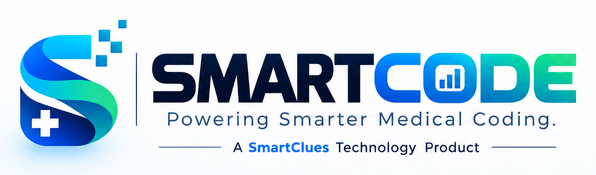

# SmartCode V2 — Documentation

**SmartCode Enterprise V2** — medical coding operations platform, a SmartClues Technology product. Built from zero: new architecture, database, schema, authentication, RBAC, APIs, UI, tests and deployment. The previous SmartCode repository is a requirements reference only.

**Phase 0 approved 2026-10-07. Phase 1 (foundation) complete — awaiting approval for Phase 2.** No business modules are implemented yet. Phase reports: [`phases/`](phases/).

## Index

| #   | Document                                                                        |
| --- | ------------------------------------------------------------------------------- |
| 01  | [System architecture, folder structure, technology choices](01-architecture.md) |
| 02  | [Database architecture & ERD](02-database-architecture.md)                      |
| 03  | [RBAC matrix](03-rbac-matrix.md)                                                |
| 04  | [Module specification (34 modules)](04-module-specification.md)                 |
| 05  | [API specification](05-api-specification.md)                                    |
| 06  | [Authentication architecture](06-authentication.md)                             |
| 07  | [Employee lifecycle](07-employee-lifecycle.md)                                  |
| 08  | [Chart lifecycle](08-chart-lifecycle.md)                                        |
| 09  | [Audit, review, rework & re-audit lifecycle](09-audit-lifecycle.md)             |
| 10  | [CSV import framework](10-csv-framework.md)                                     |
| 11  | [Deployment architecture (AWS + Vercel + CI/CD)](11-deployment-architecture.md) |
| 12  | [Environment configuration](12-environment-configuration.md)                    |
| 13  | [Testing strategy](13-testing-strategy.md)                                      |
| 14  | [Implementation roadmap](14-implementation-roadmap.md)                          |
| 15  | [Branding](15-branding.md)                                                      |
| 16  | [Security architecture](16-security.md)                                         |

## Decisions

### Final (approved 2026-10-07)

| ID   | Decision                                                                                                                                                                                                                                                                                                                          |
| ---- | --------------------------------------------------------------------------------------------------------------------------------------------------------------------------------------------------------------------------------------------------------------------------------------------------------------------------------- |
| D-01 | Audit: Coder → PENDING_AUDIT → Auditor. PASS → AUDITED → COMPLETED. REVIEW_REQUIRED → **Manager review**: APPROVE → COMPLETED, REJECT → REWORK → Coder → RE_AUDIT → … → COMPLETED. Only MANAGER resolves; Team Lead → 403; Group Coach/SME cannot resolve; Auditor cannot resolve own decision. Enforced in backend and database. |
| D-02 | 100 % audit coverage in V1 — every coded chart enters the audit queue. No sampling.                                                                                                                                                                                                                                               |
| D-03 | One Chart Allocation Engine with Manual, CSV and Automatic entry points. Automatic = Manager selects project + eligible coders; balanced-workload distribution. Eligibility: ACTIVE, valid Login Name, assigned to project, role CODER, not disabled.                                                                             |
| D-04 | Chart ID unique within a project: `UNIQUE(project_id, chart_ref)`.                                                                                                                                                                                                                                                                |
| D-05 | Designed as a healthcare application that may handle identifiable US medical data. Synthetic data only in development/testing. No "HIPAA compliant" claim; production environment reviewed before real PHI.                                                                                                                       |
| D-06 | Domains are configuration (`WEB_URL`, `API_URL`, `APP_URL`); localhost in development.                                                                                                                                                                                                                                            |
| D-09 | Smart HRMS: integration boundary + documented integration points only; no invented API or fake sync; identity by Employee ID.                                                                                                                                                                                                     |
| D-11 | Production: Page Count, ICDs, DOS (no JCD anywhere). Audit: Audit Errors + Error Exceptions stored separately; Total Errors computed.                                                                                                                                                                                             |
| D-16 | Display "SPC" as-is; meaning not expanded; terminology configurable without architectural change.                                                                                                                                                                                                                                 |
| D-19 | Initial commits allowed on `main` / `develop`; Phase 0 baseline then Phase 1 separately; no secrets.                                                                                                                                                                                                                              |
| Logo | Original is the source of truth, untouched. Derived crops/resizes only where technically necessary. Dark UI → original inside a light container. No manufactured transparent/dark version.                                                                                                                                        |

### Still open (not blocking Phase 1)

| ID   | Question                                                                                        | Current assumption                                  | Needed by   |
| ---- | ----------------------------------------------------------------------------------------------- | --------------------------------------------------- | ----------- |
| D-07 | Scope/users of Group Coach/SME workspace, HR role, Internal Audit workspace, Visitor Management | As drafted in `03`/`04`                             | Phase 11–12 |
| D-08 | Vendor Admin may not assign login names or allocate charts                                      | Manager only (as specified)                         | Phase 4     |
| D-10 | CPH formula and hour capture                                                                    | Configurable versioned formula; active-time capture | Phase 8     |
| D-12 | Deactivating an employee with allocated charts/rework                                           | Block until reallocated or Manager confirms         | Phase 3     |
| D-13 | Official transparent / SVG / high-resolution logo                                               | Use light container on dark surfaces                | Any time    |
| D-14 | Roles fixed in code vs configurable                                                             | Fixed enum + code permission matrix                 | Phase 2     |
| D-15 | Re-audit by original auditor or any project auditor                                             | Any project auditor, original preferred             | Phase 9     |
| D-17 | Breached-password check (external k-anonymity call)                                             | Enabled                                             | Phase 3     |
| D-18 | Expected users / charts per day; error tracking (Sentry)                                        | Sizing estimate when volumes known                  | Phase 13    |
